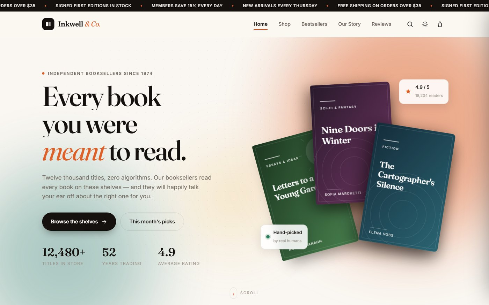
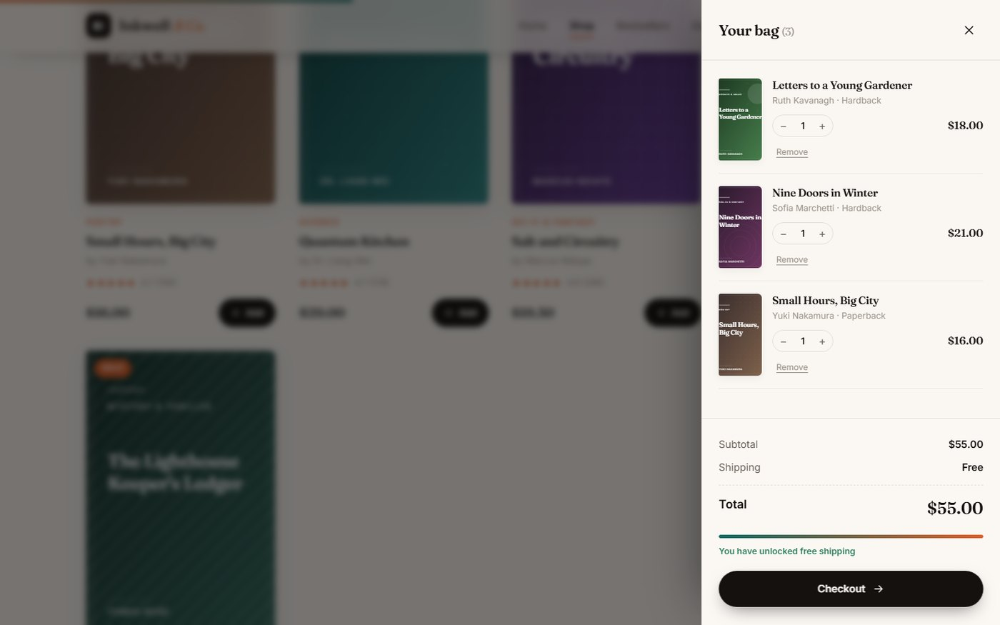
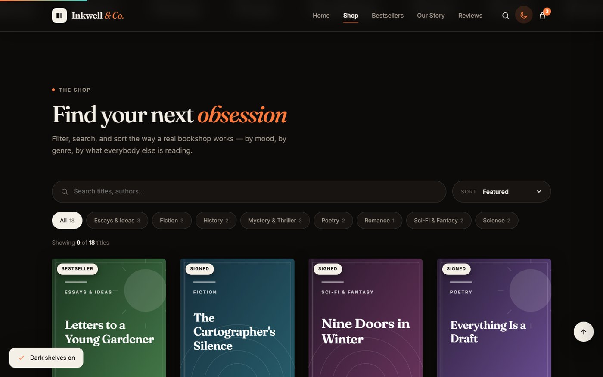

# Inkwell & Co.

A modern, animated online bookstore storefront — plain HTML, CSS and JavaScript.
No framework, no build step, no dependencies.



## What's in it

**Storefront**
- 18 books across 8 genres, with a filter chip row, live search and 5 sort modes
- Load-more pagination, 9 titles at a time
- Quick-view modal with format, page count and publication year
- Bestseller rail with drag-to-scroll and snap points

**Cart**
- Slide-out drawer with quantity steppers and per-line removal
- Persists to `localStorage`, so the bag survives a refresh
- Free-shipping meter that fills as you approach the threshold

**Motion**
- Staggered masked-line reveal on the hero headline
- Scroll-triggered reveals via `IntersectionObserver`
- 3D tilt on covers, magnetic buttons, parallax hero stack
- Fly-to-cart animation when you add a book
- Animated counters, preloader, scroll progress bar

**Presentation**
- Light and dark themes, remembered across visits
- Responsive down to 390px
- Honours `prefers-reduced-motion` — every animation collapses cleanly

## Running it

No install, no build step:

```bash
git clone https://github.com/aann53614-a11y/bookstore.git
cd bookstore
python -m http.server 8000
```

Then open <http://localhost:8000>.

## Structure

```
bookstore/
├── index.html      markup and section shells
├── css/style.css   design tokens, layout, animation
├── js/app.js       data, rendering, cart, interaction
└── docs/           screenshots
```

## Notes on the implementation

**Book covers are generated, not images.** Each cover is an inline SVG built at
runtime from the book's data — a gradient pair plus one of six decorative
patterns (arcs, grid, dots, stripes, waves, sun). The title is wrapped and the
type scaled down until the longest line fits the cover's live area, with
`textLength` / `lengthAdjust` as a guard against font-metric drift. The project
ships without a single raster asset.

**Design tokens drive everything.** All colour, spacing, radius and easing live
as custom properties on `:root`. The dark theme is one `[data-theme="dark"]`
block that redefines them, so no rule is written twice.

**Nothing is a dependency.** Fonts load from Google Fonts with system fallbacks;
there is no icon library and no animation library.

## Screenshots

| Cart drawer | Dark mode |
| --- | --- |
|  |  |

## Browser support

Modern evergreen browsers. Relies on `IntersectionObserver`, CSS custom
properties, `color-mix()`, `clamp()` and `aspect-ratio`.

## Note

A demonstration storefront. The books, authors, reviews and address are
invented, and checkout is deliberately inert — no payment is taken.
